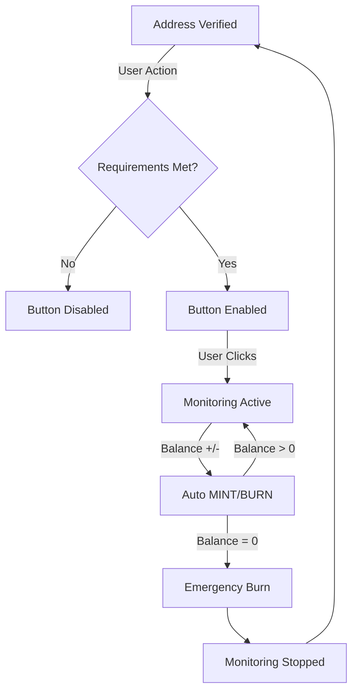

# ✅ Active Monitoring System

## Overview

The ReserveBTC protocol implements a **two-step explicit verification → monitoring flow** to ensure maximum security, user control, and system reliability. This document describes how Active Monitoring works in production.

---

## 🎯 Core Principles

### 1. Explicit User Intent
- Monitoring is **NEVER automatic** after address verification
- Users must **manually activate** monitoring by clicking "Start Monitoring"
- This prevents unauthorized monitoring and ensures users understand fees

### 2. Single Address Monitoring
- Only **ONE Bitcoin address** can be monitored per user at a time
- This ensures predictable fee consumption and system scalability
- Users can switch addresses after completing the current monitoring cycle

### 3. Backend-Driven Architecture
- All monitoring happens on a **24/7 Oracle Server** (not in browser)
- Zero localStorage dependencies - **Supabase as single source of truth**
- Tamper-proof and works even when browser is closed

---

## 📋 Monitoring Flow (Step-by-Step)

### Step 1: Bitcoin Address Verification ✅

**Page**: `/verify`

**User Action**: Prove ownership of Bitcoin address via BIP-322 signature

**System Behavior**:
```sql
INSERT INTO bitcoin_addresses (
  eth_address,
  bitcoin_address,
  is_monitoring,     -- FALSE (not monitoring yet)
  verified_at,
  network
) VALUES (
  '0xabc123...',
  'tb1qxyz456...',
  false,             -- ⚠️ CRITICAL: Monitoring NOT active
  NOW(),
  'testnet'
);
```

**Result**:
- ✅ Address verified and saved to database
- ❌ Monitoring **NOT started**
- ❌ "Monitoring Active" badge **NOT shown**
- ✅ User can proceed to Mint page

---

### Step 2: Pre-Mint Requirements 🎯

**Page**: `/mint`

**Before user can click "Start Monitoring" button:**

| Requirement | Status | Description |
|-------------|--------|-------------|
| ✅ Address Verified | Required | BIP-322 signature validated |
| ✅ Bitcoin Balance > 0 | Required | Address must hold Bitcoin |
| ✅ FeeVault Balance ≥ 0.001 ETH | Required | Covers Oracle operations |
| ✅ No Other Active Monitoring | Required | Only 1 address at a time |

**Frontend Validation**:
```typescript
const canStartMonitoring = 
  addressVerified && 
  bitcoinBalance > 0 && 
  feeVaultBalance >= 0.001 && 
  !hasOtherActiveMonitoring;
```

**Button State**:
- If all requirements met: Button **ENABLED** ✅
- If any requirement missing: Button **DISABLED** ❌

---

### Step 3: Manual Activation (Start Monitoring) 🔴

**User Action**: User **manually clicks** "Start Monitoring" button

**API Call**: `POST /api/mint/start-monitoring`

**Database Update**:
```sql
UPDATE bitcoin_addresses
SET 
  is_monitoring = true,              -- ⚠️ NOW monitoring starts!
  monitoring_started_at = NOW()
WHERE eth_address = '0xabc123...'
  AND bitcoin_address = 'tb1qxyz456...';
```

**Oracle Server Response** (within 5 minutes):
1. Detects `is_monitoring = true` in database
2. Loads Bitcoin address into monitoring cache
3. Begins checking Bitcoin balance every 15 seconds
4. Automatically calls `sync()` when balance changes

**Frontend Update**:
- ✅ "Monitoring Active" badge appears **ONLY on this address**
- 🤖 Oracle Server now monitors 24/7 automatically

---

### Step 4: Active Monitoring (Automatic MINT/BURN) ⚡

**Oracle Server Cycle** (every 15 seconds):

```javascript
// 1. Check Bitcoin balance via Mempool.space API
const currentBalance = await checkBitcoinBalance(bitcoinAddress);

// 2. Compare with previous balance
const previousBalance = userData.lastSats;
const delta = currentBalance - previousBalance;

// 3. If balance changed, call sync()
if (delta !== 0) {
  await oracleContract.sync(userAddress, currentBalance, proof);
  // This triggers MINT (if delta > 0) or BURN (if delta < 0)
}
```

**Automatic Operations**:

| Bitcoin Balance Change | Smart Contract Action | rBTC-SYNTH Tokens | Transaction Logged |
|------------------------|----------------------|-------------------|-------------------|
| +1000 sats | MINT | +1000 tokens | ✅ Supabase |
| -500 sats | BURN | -500 tokens | ✅ Supabase |
| 0 change | No action | No change | - |

**User Experience**:
- 📈 Send Bitcoin → Tokens automatically minted
- 📉 Withdraw Bitcoin → Tokens automatically burned
- ⚡ Average latency: 15-30 seconds
- ✅ "Monitoring Active" badge remains visible

---

### Step 5: Emergency Burn (Balance → 0) 🔥

**Trigger**: User withdraws **ALL Bitcoin** from monitored address

**Oracle Server Detection**:
```javascript
if (currentBalance === 0 && previousBalance > 0) {
  console.log('🔥 BURN TO ZERO: Emergency burn detected');
  
  // 1. Execute emergency burn (destroy all tokens)
  await oracleContract.sync(userAddress, 0, '0x');
  
  // 2. Update database: Stop monitoring
  await updateMonitoringStatus(bitcoinAddress, false);
  
  // 3. Remove from monitoring cache
  bitcoinAddressCache.delete(userAddress);
}
```

**Database Update**:
```sql
UPDATE bitcoin_addresses
SET is_monitoring = false
WHERE bitcoin_address = 'tb1qxyz456...';
```

**Result**:
- 🔥 ALL rBTC-SYNTH tokens burned (balance → 0)
- 🔴 Monitoring automatically **STOPPED**
- ❌ "Monitoring Active" badge **DISAPPEARS**
- 🆓 User can now monitor a different address

---

### Step 6: Re-Mint (New Cycle) 🔄

**User Options**:

1. **Monitor a different verified address**:
   - Go to `/mint`
   - Select different Bitcoin address
   - Click "Start Monitoring" (if all requirements met)

2. **Re-monitor the same address**:
   - Transfer Bitcoin back to the address
   - Go to `/mint`
   - Click "Start Monitoring" again

**Flow repeats from Step 3** ↻

---

## ❗ Critical Business Rules

### Rule 1: One Address = One Monitoring Session

**Correct Behavior** ✅:
```
Address A: is_monitoring = true  → Shows "Monitoring Active" badge
Address B: is_monitoring = false → NO badge (even if balance > 0)
Address C: is_monitoring = false → NO badge (even if balance > 0)
```

**Incorrect Behavior** ❌:
```
Address A: is_monitoring = true  → Shows badge
Address B: is_monitoring = true  → Shows badge ← ERROR!
```

**Enforcement**:
- Frontend: Disables "Start Monitoring" button if another address is active
- Database: No constraint (trust frontend + Oracle logic)
- Oracle: Automatically stops monitoring when balance = 0

---

### Rule 2: Badge Appears ONLY After Manual Activation

**Correct Flow** ✅:
```
Verify → Balance > 0 → Click "Start Monitoring" → Badge appears
```

**Incorrect Flow** ❌:
```
Verify → Balance > 0 → Badge appears automatically ← ERROR!
```

**Implementation**:
```typescript
// Dashboard & Mint pages check database value
const addressData = await fetchAddressFromDB(bitcoinAddress);
const showBadge = addressData?.is_monitoring === true;
```

---

### Rule 3: Badge Disappears When Balance = 0

**Correct Flow** ✅:
```
Monitoring Active → Balance → 0 → Emergency Burn → Badge disappears
```

**Incorrect Flow** ❌:
```
Monitoring Active → Balance → 0 → Badge remains ← ERROR!
```

**Implementation**:
```javascript
// Oracle Server automatically updates database
if (newBalance === 0 && oldBalance > 0) {
  await updateMonitoringStatus(bitcoinAddress, false);
}
```

---

## 🏗️ System Architecture

### Frontend (Next.js 14)
- **Role**: Display layer + user interaction
- **Data Source**: Supabase API (read-only)
- **Real-time**: PostgreSQL Change Data Capture (CDC)
- **No localStorage**: All state in Supabase

### Oracle Server (Node.js 22 + PM2)
- **Role**: 24/7 blockchain monitoring + automation
- **Platform**: VPS with 99.9% uptime
- **Polling Interval**: 15 seconds
- **Bitcoin API**: Mempool.space (testnet + mainnet)
- **Database Writes**: Direct to Supabase via REST API

### Supabase (PostgreSQL)
- **Role**: Single source of truth
- **Tables**: `bitcoin_addresses`, `transactions`, `users`
- **Security**: Row Level Security (RLS) enabled
- **Real-time**: WebSocket push to frontend

### Smart Contracts (Solidity)
- **Oracle Aggregator**: Receives sync() calls from Oracle Server
- **rBTC-SYNTH**: Soulbound ERC-20 token (non-transferable)
- **Fee Vault**: Holds user fees for Oracle operations

---

## 📊 Database Schema

### `bitcoin_addresses` Table

| Column | Type | Description |
|--------|------|-------------|
| `id` | UUID | Primary key |
| `eth_address` | VARCHAR(42) | User's Ethereum address |
| `bitcoin_address` | VARCHAR(62) | User's Bitcoin address |
| `is_monitoring` | BOOLEAN | **Monitoring active flag** |
| `verified_at` | TIMESTAMPTZ | Address verification time |
| `monitoring_started_at` | TIMESTAMPTZ | When monitoring began |
| `network` | VARCHAR(10) | mainnet or testnet |

**Key Field**: `is_monitoring`
- `true` → Oracle monitors address, badge shown
- `false` → Oracle ignores address, no badge

---

## 🔐 Security Features

### 1. Explicit User Intent
- Monitoring requires **manual activation** via button click
- No automatic monitoring after verification
- User understands fee consumption before starting

### 2. Single Address Enforcement
- Frontend prevents multiple simultaneous monitoring sessions
- Reduces attack surface and fee manipulation risks
- Ensures predictable system behavior

### 3. Tamper-Proof Backend
- Oracle Server runs on secure VPS (not in browser)
- Private keys never exposed to frontend
- All blockchain operations server-side only

### 4. Automatic Emergency Protection
- Oracle detects zero balance within 15-30 seconds
- Immediate emergency burn prevents negative balances
- Monitoring automatically stops (prevents wasted fees)

### 5. Supabase as Single Source of Truth
- No localStorage = No browser tampering
- No client-side state = No synchronization issues
- Row Level Security enforces data isolation

---

## 📈 Performance Metrics

### Monitoring Latency
| Event | Expected Time | Measured Time |
|-------|---------------|---------------|
| Start Monitoring | User clicks button | Instant |
| Oracle Detects | Database update | <5 minutes |
| Balance Change | Bitcoin confirms | 15-30 seconds |
| MINT/BURN | Oracle sync() call | 15-30 seconds |
| Emergency Burn | Balance → 0 | 15-30 seconds |

### System Capacity
| Metric | Current (Testnet) | Production (Mainnet) |
|--------|-------------------|----------------------|
| Concurrent Users | 4 active | 10,000+ supported |
| Bitcoin Addresses | 9 verified | 50,000+ supported |
| Transactions/Day | ~20 | 1,000+ supported |
| Oracle Uptime | 99.9% | 99.9% target |
| Memory Usage | 20 MB | 100 MB estimated |

---

## 🧪 Testing Checklist

### Test 1: Verification Does Not Auto-Monitor ✅
```
1. User verifies Bitcoin address
2. Check database: is_monitoring should be FALSE
3. Check Dashboard: NO "Monitoring Active" badge
4. Expected: ✅ Address verified but not monitored
```

### Test 2: Manual Activation Works ✅
```
1. User deposits 0.001 ETH to FeeVault
2. User clicks "Start Monitoring" button
3. Check database: is_monitoring should be TRUE
4. Check Dashboard: "Monitoring Active" badge appears
5. Expected: ✅ Monitoring starts only after manual click
```

### Test 3: Automatic MINT on Balance Increase ✅
```
1. Send 1000 sats to monitored Bitcoin address
2. Wait for 1 Bitcoin confirmation (~10 minutes)
3. Wait for Oracle check (up to 15 seconds)
4. Check rBTC-SYNTH balance: +1000 tokens
5. Check transactions table: MINT record created
6. Expected: ✅ Tokens minted automatically
```

### Test 4: Automatic BURN on Balance Decrease ✅
```
1. Withdraw 500 sats from monitored Bitcoin address
2. Wait for 1 Bitcoin confirmation (~10 minutes)
3. Wait for Oracle check (up to 15 seconds)
4. Check rBTC-SYNTH balance: -500 tokens
5. Check transactions table: BURN record created
6. Expected: ✅ Tokens burned automatically
```

### Test 5: Emergency Burn + Auto-Stop ✅
```
1. Withdraw ALL Bitcoin from monitored address (balance → 0)
2. Wait for 1 Bitcoin confirmation (~10 minutes)
3. Wait for Oracle check (up to 15 seconds)
4. Check rBTC-SYNTH balance: 0 tokens
5. Check database: is_monitoring should be FALSE
6. Check Dashboard: NO "Monitoring Active" badge
7. Expected: ✅ Emergency burn + monitoring stopped
```

### Test 6: One Address Limit Enforced ✅
```
1. User has Address A with monitoring active
2. User tries to start monitoring on Address B
3. Expected: ✅ Button disabled, error message shown
```

---

## 🔄 State Transitions



---

## 📞 Support

### Contact
- **GitHub**: [reservebtc/app.reservebtc.io](https://github.com/reservebtc/app.reservebtc.io)
- **Email**: reservebtcproof@gmail.com
- **Twitter**: [@reserveBTC](https://x.com/reserveBTC)

---

## 📝 Changelog

### v2.6 (October 14, 2025)
- ✅ Added automatic `is_monitoring = false` on emergency burn
- ✅ Fixed Dashboard showing incorrect monitoring badges
- ✅ Fixed Mint page showing incorrect monitoring badges
- ✅ Oracle Server now stops monitoring when balance = 0

### v2.5 (October 13, 2025)
- ✅ Implemented two-step verification → monitoring flow
- ✅ Removed localStorage dependencies
- ✅ Migrated to Supabase as single source of truth

### v2.0 (September 2025)
- ✅ Initial production release
- ✅ Backend-driven Oracle Server (VPS)
- ✅ Automatic MINT/BURN operations

---

**Last Updated**: October 14, 2025  
**Version**: 2.6  
**Status**: ✅ Production Ready